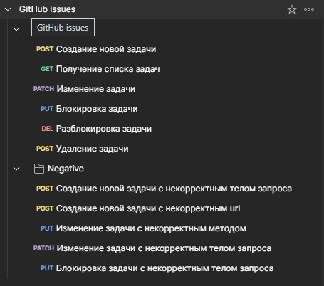

**Для работы с коллекцией необходимо:**
1. Скачать файл коллекции - GitHub issues.postman_collection.
2. Импортировать коллекцию в Postman.

3. Сгенерировать на Гитхабе свой Personal access tokens (classic).  
4. Вставить этот токен  в поле авторизации колекции, как показано на рисунке. Сохранить изменения.

5. Cоздание задачи.

6. Получение списка задач.

7. Изменение задачи.

8. Блокировка задачи.

9. Разблокировка задачи.

10. Удаление задачи.  
В документации нет описания метода удаления issue.  
В запросе сервера на удаление задачи видно, какие данные уходят.

  
Но ввиду постоянной смены этого токена и не имея возможности определить его положение (в куках нет) 
оставлю этот запрос так.....

11. Аналогичные запросы можно отправить с негативными проверками.

